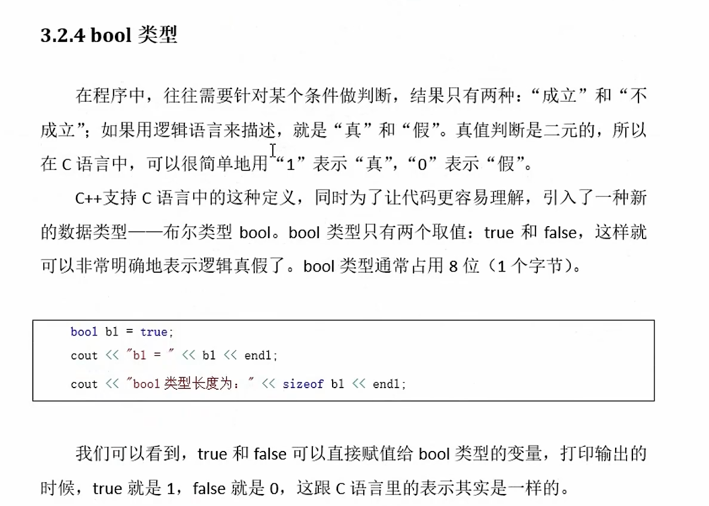
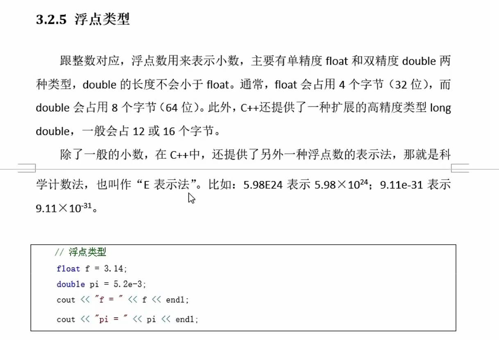
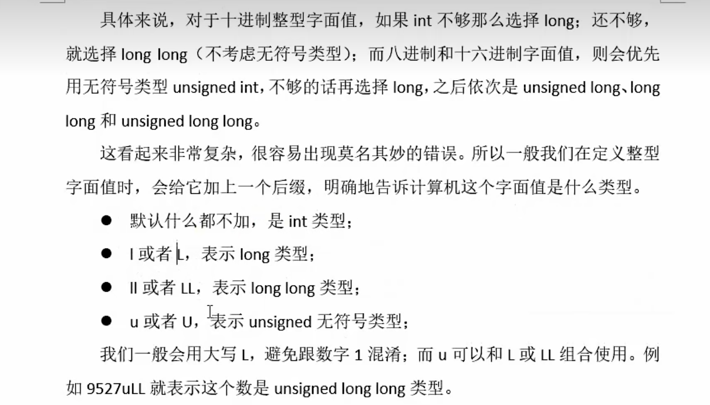
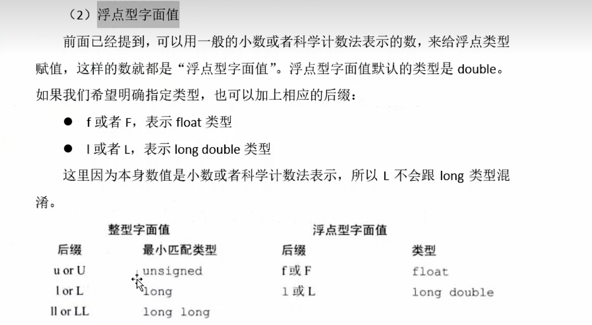
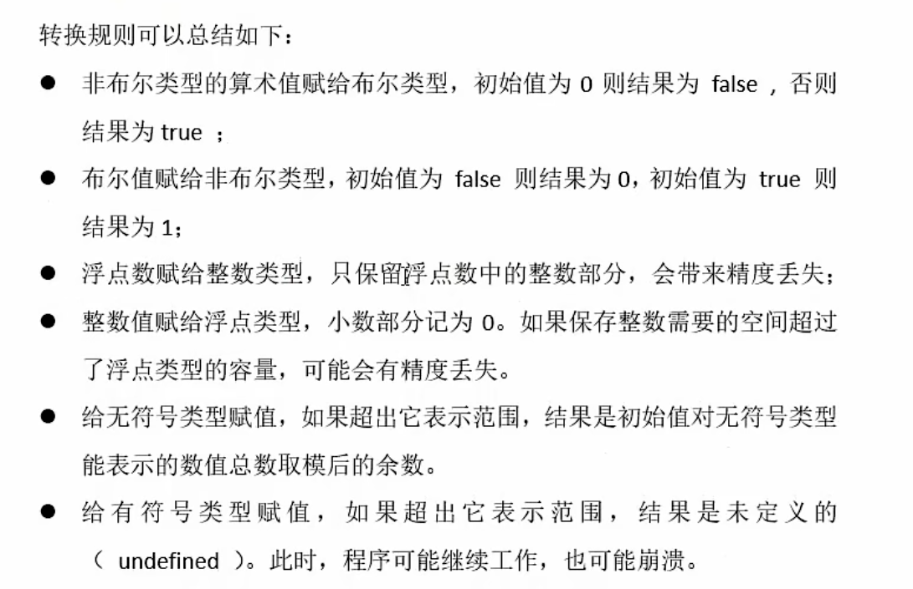

# 基础数据类型

基础数据类型包含算术类型和空类型

##  算术类型

### 整型 （Intergal Types）
```
基本的整型 ： char  short  int long (long long) bool
              1B    2B     4B  4B      8B       None
可以使用sizeof来计算变量的长度
```
注意整数类型数据的可表示的数据范围 注意数据溢出
### 无符号整型

```
如果确定使用的变量不可能为负数 那么可以直接使用无符号数据
无符号类型 unsigned 特定是指不能表示负数的类型 范围是 0 ~ 正数最大值
unsigned int age = 100;
```
### Bool 类型
一般占用8个bit 也就是一个字节 B


### 浮点类型 
处理小数：
主要有 单精度浮点 float ；双精度浮点 double  
  
float占用4个字节 double占用8个字节 long double 占用12或16字节（长双精度浮点）

还有一个科学计数法，也叫做E表示法:  
**case ::  **  
**5.98E23 表示 ： 5.98 * pow(10.23)**

  
  

### 整型字面常量
  
  正常书写 10 20 30 这都是十进制数值  
    
  除此之外，还可以书写二进制或者八进制或者十六进制的数值  
    
  case:  
  字面量 30  （十进制）  
  **八进制30** -->  036   
 ```
  0开头的数字表示八进制数值   那么036转换为十进制就是 6 + 3*8 = 30  
 ```
  **十六进制30** ---> 0x1E  
  ```
  0x开头的表示十六进制数值  那么0x1E转换为十进制就是 14 + 1*16 = 30  

  ```  
    
    
### 浮点字面常量  


  
### 字符 字符串字面值常量  
  
```cpp
//字符字面常量
cout << 'a' << endl; // 字符字面常量
cout << sizeof('a') << endl; // 4 字节  'a' 实际上是一个整型字面常量
cout << '\n' << endl; // 转义字符字面常量 
// 字符串字面常量
cout << "Hello, C++" << endl; // 字符串字面常量
cout << sizeof("Hello, C++") << endl; // 11 字节
```  

### 类型转换   

在使用字面数值常量的时候 如果遇到数值超出了变量类型所能表示的范围 或者 把一个浮点数值赋值给一个int类型 数值，这时程序会进行自动类型转换。    
  

  
```cpp
#include<iostream>
using namespace std;

int main(){
    //1. int 赋值给 bool
    bool flag = 25;
    cout << flag << endl; // 1  true  自动类型转换
    //2. bool 赋值给 int
    int a = true;
    int b = false;
    cout << b << endl; // 0
    cout << a << endl; // 1
    //3. 浮点类型赋值给整型
    int c = 3.99;
    cout << c << endl; // 3  自动类型转换 截断小数部分
    //4. 整型赋值给浮点类型
    float d = 3;
    cout << d << endl; // 3  自动类型转换
    //5. char 和 int 之间的转换
    char e = 'A';
    int f = e; // char 自动类型转换为 int
    cout << f << endl; // 65  ASCII 码值
    //6. 复制超出了整型范围
    unsigned short  untrans = 65536 ; // 2 字节  65536 超出范围
    cout << untrans << endl; // 0  溢出
    short unshort2 = 65536; // 2 字节  65536 超出范围
    cout << unshort2 << endl; // 0  溢出

    //7. 赋值超出范围
    return 0;
}
```

