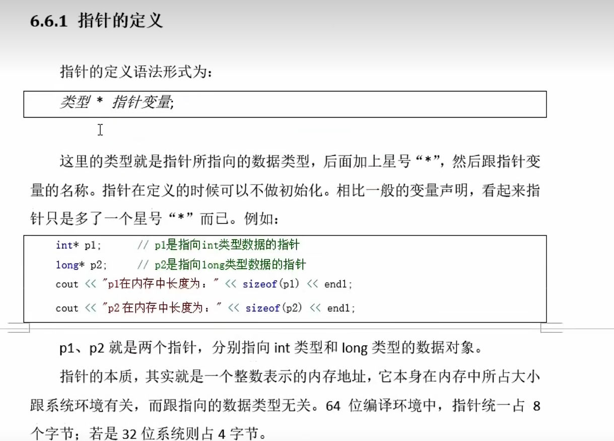

# 复合数据类型 Composite Data Types

## 数组 Array
>数组是最常用的复合数据类型，数组可以存储多个**相同类型的数据**。

  
```cpp
#include <iostream>
using namespace std;
int main(){
    //数组定义
    //1
    int arr_1[5];
    //2
    float arr_2[3] = {1.1, 2.2, 3.3};
    //3 
    string arr_3[5] = {"a", "b", "c"}; //未占用空间补0
    //4
    double arr_4[] = {1.1, 2.2, 3.3, 4.4};

}
```  
   

### 数组访问
1. 访问数组元素  ： 索引 / 下标  数组名[索引] ，如果超出数组范围，那么会导致**未定义行为**。 索引范围是 **0~数组长度-1**  
2. 数组的大小  
>数组的整体空间 = 数组元素的空间 * 元素个数  
```cpp
#include <iostream>
using namespace std;
int main(){
    int arr_1[5] = {1,2,3,4,5};
    cout << "arr_1 size : " << sizeof(arr_1) << endl; // 20
    cout << "arr_1 element size : " << sizeof(arr_1[0]) << endl; // 4
    cout << "arr_1 length : " << sizeof(arr_1) / sizeof(arr_1[0]) << endl; // 5
}
```   
**数组遍历**  
```cpp
#include <iostream>
using namespace std;
int main(){
    int arr_1[5] = {1,2,3,4,5};
    for(int i = 0;i < sizeof(arr_1) / sizeof(arr_1[0]);i++){
        cout << arr_1[i] << endl;
    }
}
```   
范围for循环  
```cpp
#include <iostream>
using namespace std;
int main(){
    int arr_1[5] = {1,2,3,4,5};
    for(int i : arr_1){
        cout << i << endl;
    }
}
```  
### 多维数组
  
```cpp
#include <iostream>
using namespace std;
int main(){
    int arr_2d[2][3][4] = {
        {
            {1,2,3,4},
            {5,6,7,8},
            {9,10,11,12}
        },
        {
            {13,14,15,16},
            {17,18,19,20},
            {21,22,23,24}
        }
    }
}
```  

**访问多维数组**
```cpp
#include <iostream>
using namespace std;
int main(){
    int arr_2d[2][3][4] = {
        {
            {1,2,3,4},
            {5,6,7,8},
            {9,10,11,12}
        },
        {
            {13,14,15,16},
            {17,18,19,20},
            {21,22,23,24}
        }
    };
    // 访问多维数组
    cout << arr_2d[0][0][0] << endl; // 1
    cout << arr_2d[1][2][3] << endl; // 24
}
```  

```cpp
//范围for循环遍历多维数组
#include <iostream>
using namespace std;
int main(){
    int arr_2d[2][3] = {
        {1,2,3},
        {4,5,6}
    };
    for (auto& row:arr_2d){
        for (auto& elem:row){
            cout << elem << endl;
        }
    }

}
```  
### 选择排序
  
### 冒泡排序
  


> 数组虽然能够存储多个相同类型的数据，但是数组的长度是固定的，一旦定义了数组的长度，那么就不能改变数组的长度。  

> 微软提供了标准模板库 STL，STL 是 C++ 标准库的一部分，STL 提供了很多常用的数据结构和算法，比如 vector、list、deque、set、map 等。  

## 模板类 Vector
> 向量（vector）是一个能够存**放任意类型的动态数组**，能够增加和压缩数据。   

C++ 中的 vector 是什么？
std::vector 是 C++ 标准模板库（STL）中的一个容器，它表示一个动态数组。与普通数组不同，vector 的大小可以在运行时动态增长或缩小，而不需要在编译时确定大小。

主要特点：
动态大小：可以在程序运行时添加或删除元素。
连续存储：元素在内存中是连续存储的，这使得随机访问非常高效。
自动管理内存：当添加或删除元素时，vector 会自动处理内存分配和释放。
类型安全：每个 vector 只能存储一种特定类型的数据。

  
### 头文件和命名空间  
> vector 是标准库中的一部分，如果使用，需要引用头文件 <vector> ，并使用命名空间 std。  

```cpp
#include <iostream>
#include <vector>
using namespace std;  // vector对vector做了定义，使用#include引入它之后，并指定std命名空间后，就可以直接使用vector
int main(){
    vector<int> vec;
    vec.push_back(1);
    vec.push_back(2);
    vec.push_back(3);
    for (int i : vec){
        cout << i << endl;
    }
}
```  
### vector 基本用法  
> vector是一个模板类，用于创建类的模子，在使用的时候需要提供具体的类型信息。  
```cpp
#include<iostream>
#include<vector>
using namespace std;
vactor<int> v_1 ;
```  
**vector初始化方法**  
```cpp
#include<iostream>
#include<vector>
using namespace std;
int main(){
    // 默认初始化
    vector<int> v_1;
    // 列表初始化
    vector<char> v_2 = {'a','b','c'};
    vector<float> v_3 {1.1,2.2,3.3};
    // 直接初始化
    vector<short>v_4(5); // 5个元素，每个元素的值都是0
    vector<double>v_5(3,1.1); // 3个元素，每个元素的值都是1.1
}

```

  
**vector常用方法**    
1. 访问元素依然通过 索引 来访问
    特殊：
```cpp
v[0]; // 访问第一个元素
v.at(0); // 访问第一个元素
v.at(1); // 访问第二个元素
v.at(v.size() - 1); // 访问最后一个元素
v.front(); // 访问第一个元素
v.back(); // 访问最后一个元素
v[1]; // 访问第二个元素
```
2. 添加元素
```cpp
v.push_back(1); // 在vector的末尾添加一个元素
v.insert(v.begin(),2); // 在vector的开头添加一个元素
v.insert(v.begin() + 1,3); // 在vector的第二个位置添加一个元素
```
3. 获取数组大小
```cpp 
v.size(); // 返回vector中元素的个数
```
4. 删除元素
```cpp
v.erase(v.begin()); // 删除vector的第一个元素
v.erase(v.begin() + 1); // 删除vector的第二个元素
v.erase(v.begin() + 1,v.begin() + 3); // 删除vector的第二个元素到第四个元素
v.clear(); // 删除vector中的所有元素
v.pop_back(); // 删除vector的最后一个元素
```

5. 检查是否为空
```cpp
v.empty(); // 返回vector是否为空
```  


```cpp
#include<iostream>
#include<vector>
using namespace std;
int main(){
    vector<int> v_1;
    // 列表初始化
    vector<char> v_2 = {'a','b','c'};
    vector<float> v_3 {1.1,2.2,3.3};
    // 直接初始化
    vector<short>v_4(5); // 5个元素，每个元素的值都是0
    vector<double>v_5(3,1.1); // 3个元素，每个元素的值都是1.1
    // 常用方法
    v_1.push_back(1); // 在vector的末尾添加一个元素
    v_1.pop_back(); // 删除vector的最后一个元素
    v_1.size(); // 返回vector中元素的个数
    v_1.empty(); // 返回vector是否为空
    v_1.clear(); // 删除vector中的所有元素
}
```  


## 字符串 String 
  
    
```cpp
#include<iostream>
#include<string>
using namespace std;
int main(){
    string s_1;
    string s_2 = "hello";
    string s_3 = s_2;
    string s_4(5,'a');
    string s_5("hello world");
    return 0;
}
```  
### 字符串常用方法
1. 访问字符串中的字符
```cpp
s_1[0]; // 访问第一个字符
s_1.at(0); // 访问第一个字符
s_1.front(); // 访问第一个字符
s_1.back(); // 访问最后一个字符
```  
2. 获取字符串长度
```cpp 
s_1.size(); // 返回字符串的长度
```  
3. 添加字符
```cpp  
s_1.push_back('a'); // 在字符串的末尾添加一个字符
s_1.append("hello"); // 在字符串的末尾添加一个字符串
s_1.insert(s_1.begin(),'a'); // 在字符串的开头添加一个字符
s_1.insert(s_1.begin() + 1,"hello"); // 在字符串的第二个位置添加一个字符串
```  
4. 删除字符
```cpp 
s_1.pop_back(); // 删除字符串的最后一个字符
s_1.erase(s_1.begin()); // 删除字符串的第一个字符
s_1.erase(s_1.begin() + 1); // 删除字符串的第二个字符
s_1.erase(s_1.begin() + 1,s_1.begin() + 3); // 删除字符串的第二个字符到第四个字符
```  
5. 查找字符
```cpp
s_1.find('a'); // 查找字符在字符串中的位置，返回索引，找不到返回-1
s_1.find("hello"); // 查找字符串在字符串中的位置，返回索引，找不到返回-1
```  
6. 子字符串
```cpp
s_1.substr(0,5); // 从索引0开始，截取5个字符
```
7. 比较字符串
```cpp
s_1 == s_2; // 比较两个字符串是否相等
s_1 != s_2; // 比较两个字符串是否不相等
s_1 < s_2; // 比较两个字符串的大小
s_1 > s_2; // 比较两个字符串的大小
s_1 <= s_2; // 比较两个字符串的大小
s_1 >= s_2; // 比较两个字符串的大小
```  
  

8. 清空字符串
```cpp
s_1.clear(); // 清空字符串
```
```cpp
#include<iostream>
#include<string>
using namespace std;
int main(){
    string s_1;
    string s_2 = "hello";
    string s_3 = s_2;
    string s_4(5,'a');
    string s_5("hello world");
    return 0;
}
```  
9. 字符串拼接 
```cpp
s_1 + s_2; // 字符串拼接
s_1 += s_2; // 字符串拼接
```

  

    

## 字符数组


## C++ 迭代器知识点
### 什么是迭代器？
迭代器是 C++ 标准模板库（STL）中的一个重要概念，它提供了一种统一的方式来访问容器（如 vector、string 等）中的元素，而不需要暴露容器的内部实现细节。
### 基本用法
1. **获取迭代器**   
- `container.begin()`: 返回指向容器第一个元素的迭代器。   
- `container.end()`: 返回指向容器最后一个元素之后位置的迭代器。
2. **解引用迭代器**   
- 使用 `*` 操作符来获取迭代器指向的实际元素值。   
- 示例：`*(str3.begin() + 2)` 获取字符串 `str3` 中的第三个字符。
3. **迭代器算术运算**   
- 可以对迭代器进行加减运算来移动位置。   
- 示例：`str3.begin() + 2` 将迭代器向前移动两个位置。
4. **在容器操作中的应用**   
- 当需要指定位置进行插入或删除操作时，直接使用迭代器作为参数。   
- 示例：`s_1.insert(s_1.begin(), 'a')` 在字符串 `s_1` 的开头插入字符 'a'。
### 注意事项
- 迭代器的行为类似于指针，但提供了更高级的抽象。
- 不同类型的容器支持不同种类的迭代器（如随机访问迭代器、双向迭代器等）。  


## 读取输入的字符  

  
  
    


## 结构体 struct

   
  
  


**访问结构体的成员**
```cpp
zhangsan.name; // 访问结构体的成员
zhangsan.age; // 访问结构体的成员
zhangsan.height; // 访问结构体的成员
zhangsan.weight; // 访问结构体的成员
zhangsan.address; // 访问结构体的成员
zhangsan.phone; // 访问结构体的成员
zhangsan.email; // 访问结构体的成员
```  

  


## 枚举 enum
```cpp
enum Color{
    RED,
    GREEN,
    BLUE
};
int main(){
    Color c = RED,r = GREEN;
    Color mm = Color(2);
}

```
  

   

# 指针 pointer

   
  

> 简单理解就是 **&**就是取地址 **\***就是解引用
- *p 表示 指针p指向的内存中的数据
- p 表示 指针p指向的内存地址
- &a 表示 变量a的内存地址
- *p = 100; 表示 指针p指向的内存中的数据为100
- p = &a; 表示 指针p指向变量a的内存地址 *p 就是 a 对应的数据
```cpp
int main(){
    int a = 10;
    int *p = &a;
    cout << *p << endl;
    int b = 20;
    p = &b;
    cout << *p << endl;
    return 0;
}
```  


   
  

  

   

  


**指向常量的指针 只能指向常量，不能指向变量** 
- 该指针 指向的数据是一个常量 不能通过该指针修改指向的数据
- 该指针定义 `const int *p`

```cpp
const int a = 10;
const int *p = &a;  // 指向常量的指针 只能指向常量，不能指向变量
```
**指针常量 只能指向变量，不能指向常量** 
- 该指针 指向的地址不能变  即该指针的指向不能改变
- 该指针定义 `int * const p = &a`
```cpp

int pi = 3.14;
int * const p = &a;  // 指针常量 只能指向变量，不能指向常量
```
**指向常量的指针常量 既不能指向变量，也不能指向常量** 
- 首先是指针常量 那么结构应为 `const int *p`
- 然后是指向常量的 {指针常量} 那么应为 `const int * const p = &a`

```cpp
const int a = 10;
const int * const p = &a;  // 指向常量的指针常量 既不能指向变量，也不能指向常量
```  

## 指针和数组的关系  
- 指针和数组的关系
  - **数组名** 就是 数组的首地址
  - **指针** 可以指向 数组的首地址
  - **数组名** 可以 作为 **指针** 来使用
  - **指针** 可以 指向 **数组的 任意一个元素**
  - 数组名 可以 作为 指针 来使用 但是 只能 指向 数组的 首地址
  - 指针 可以 指向 数组的 任意一个元素 但是 数组名 只能 指向 数组的 首地址
```cpp
int a[5] = {1,2,3,4,5};
int *p = a; // 数组名 可以 作为 指针 来使用
p = &a[0]; // 指针 可以 指向 数组的 任意一个元素
```  

  
  
   

- 指针数组 
    - 指针数组 指的是 数组中的每一个元素都是 指针
- 数组指针
    - 数组指针 指的是 一个指针 指向的 是一个数组
    - 类似于指向指针的 指针  


# 引用 
- 引用就是原来的 别名 并没有创建新的空间
- 操作别名 就相当于 操作了 原来的数据
```cpp
int a = 10;
int &c  = a; // 引用 就是 原来的 别名 没有创建新的空间
// 引用的引用
int &d = c; // 引用的引用 就是 原来的 别名 没有创建新的空间
//对常量的引用
const int z = 10;
const int &ref = a; // 对常量的引用
```

  
   
